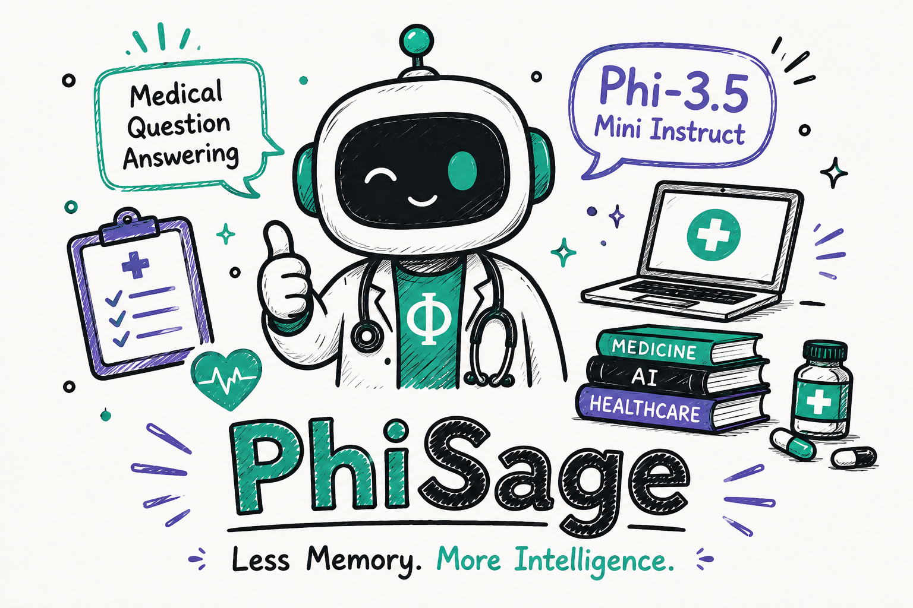

# Unsloth-PhiSage - Less Memory. More Intelligence.

### Efficient Fine-Tuning of Phi-3.5-Mini-Instruct for Medical Question Answering using Unsloth

  

<h1 align="center">Unsloth-PhiSage</h1>

<h3 align="center">
Fine-Tuning Phi-3.5-Mini-Instruct for Medical Question Answering using Unsloth
</h3>

  
  
  
  
  
  

---

# Overview

**Unsloth-PhiSage** is a domain-specific Medical Question Answering (Medical QA) model developed by fine-tuning **Phi-3.5-Mini-Instruct** on a **Medical Question & Answer Dataset** using **Unsloth**. The project demonstrates how Microsoft's compact language model can be efficiently adapted for healthcare applications while achieving faster training, reduced GPU memory consumption, and high-quality medical response generation.

---

# Features

* Medical Question Answering
* Fine-tuned Phi-3.5-Mini-Instruct
* Efficient Fine-Tuning with Unsloth
* LoRA-based Parameter-Efficient Fine-Tuning
* Medical Instruction Dataset
* Memory-Efficient Training
* Context-Aware Medical Responses
* Ready for Inference & Deployment
* Easily Extendable for Healthcare AI Research

---

# Model Architecture

  

---

# Technology Stack

* Python
* PyTorch
* Hugging Face Transformers
* Unsloth
* TRL
* PEFT (LoRA)
* Accelerate
* BitsAndBytes
* Datasets

---

# Applications

* Medical Question Answering
* AI Healthcare Assistants
* Patient Education
* Clinical Knowledge Support
* Medical Information Retrieval
* Healthcare Research
* Educational Medical Chatbots

---

# Model Efficiency

**Phi-3.5-Mini-Instruct**, combined with **Unsloth**, enables efficient fine-tuning through optimized kernels, LoRA, and 4-bit quantization. The lightweight architecture significantly reduces GPU memory requirements while maintaining strong reasoning and instruction-following capabilities, making it ideal for consumer GPUs and rapid experimentation.

### Benefits

* Faster Fine-Tuning
* Lower GPU Memory Usage
* Efficient LoRA Training
* 4-bit Quantization Support
* Faster Inference
* High-Quality Medical Responses

---

# Why Phi-3.5 + Unsloth?

Fine-tuning Large Language Models often requires powerful GPUs and significant memory resources, making domain-specific adaptation difficult on consumer hardware.

This project demonstrates that **Phi-3.5-Mini-Instruct**, combined with **Unsloth**, can be fine-tuned efficiently for Medical Question Answering while reducing GPU memory usage and maintaining high-quality, context-aware responses.

### Highlights

* Memory-efficient fine-tuning
* Faster training with Unsloth
* LoRA-based parameter-efficient adaptation
* Lower GPU memory requirements
* Strong performance on medical question answering
* Ready for inference and deployment

This repository showcases an efficient workflow for adapting **Phi-3.5-Mini-Instruct** to the medical domain using **Unsloth**, enabling faster training, lower memory consumption, and reliable Medical Question Answering on consumer-grade GPUs.

---

# Future Work

* 🔹 Retrieval-Augmented Generation (RAG) for evidence-based medical responses
* Multi-turn Clinical Conversations
* Medical Report & Clinical Note Question Answering
* Integration with Electronic Health Records (EHR)
* FastAPI REST API Deployment
* Hugging Face Spaces Demo
* GGUF & ONNX Export
* Quantization for Edge and Mobile Deployment
